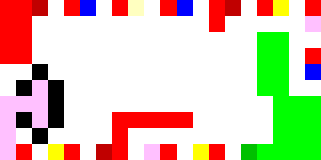
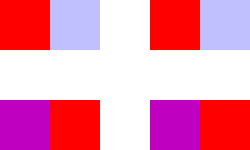
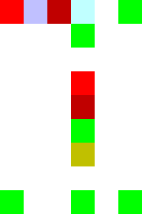

# PIETRessourceMachine
All Human Ressource Machine problem written in PIET

## Level 1 & 2 : Mail Room, Busy mail room

**Instructions :** Drag commands into this area to build a program. Your program should tell your worker to grab each thing from the INBOX, and drop it into the OUTBOX. You got a new command! You can drag JUMP arrow to jump to different lines within your program.

Codel Size : 50

Solution :
 

Ex : 
INBOX : "5 26 12 45 78 23" -> OUTBOX: "52612457823"

## Level 3 : Copy floor

**Instructions :** Ignore the INBOX for now, and just send the following 3 letters to the OUTBOX: B U G

Codel Size : 20

Solution :
 

Ex :
INBOX : "5 26 12 45 78 23" -> OUTBOX: "BUG"

## Level 4 : Scrambler Handler

 **Instructions :** Grab the first TWO things from the INBOX and drop them into the OUTBOX in the reverse order. Repeat until the INBOX is empty.

 Codel Size : 50

Solution :
 

Ex :
INBOX : "5 26 12 45 78 23" -> OUTBOX: "26545122378"

## Level 5 : Coffee time

[Is It Bonne humeur time ?](http://clos.des.roses.free.fr/isItBonneHumeurTime/)

## Level 6 : Rainy Summer

**Instructions :** For each two things in the INBOX, add them together, and put the result in the OUTBOX.

Codel Size : 50

Solution :
 

 Ex :
INBOX : "5 26 12 45 78 23" -> OUTBOX: "3157101"

## Level 7 : Zero Exterminator

**Instructions :** Send all things that ARE NOT ZERO to the OUTBOX.

Codel Size : 30

Solution :
 

 Ex:
 INBOX : "0 2 3 0 14 0 23 0" -> OUTBOX: "231423"

 ## Level 8 :  Tripler Room

 **Instructions :** For each thing in the INBOX, TRIPLE it. And OUTBOX the result.

 Codel Size : 50

Solution :
 

Ex :
INBOX : "1 2 5 9 3 6 2 45 23" -> OUTBOX: "361527918613569"

## Level 9 : Zero Preservation Initiative

**Instructions :** Send only the ZEROs to the OUTBOX

Codel Size : 30

Solution :
 

 Ex :
INBOX : "0 2 0 6 0 15 0 23" -> OUTBOX: "0000"

## Level 10 : Octoplier Suite

**Instructions :** For each thing in the INBOX, multiply it by 8, and put the result in the OUTBOX.

Codel Size : 50

Solution :
 

 Ex :
INBOX : "1 2 5 3 8 4 9 12" -> OUTBOX: "816402464327296"

## Level 11 : Sub Hallway

**Instructions :**  For each two things in the INBOX, first subtract the 1st from the 2nd and put the result in the OUTBOX. AND THEN, subtract the 2nd from the 1st and put the result in the OUTBOX. Repeat.

Codel Size : 20

Solution :
 

  Ex :
INBOX : "1 2 5 3 8 4 9 12" -> OUTBOX: "1-1-22-443-3"

## Level 12 : Tetracontiplier

**Instructions :** For each thing in the INBOX, multiply it by 40, and put the result in the OUTBOX.

Codel Size : 40

Solution :
 

  Ex :
INBOX : "1 2 5 10 20 12 3" -> OUTBOX: "4080200400800480120"